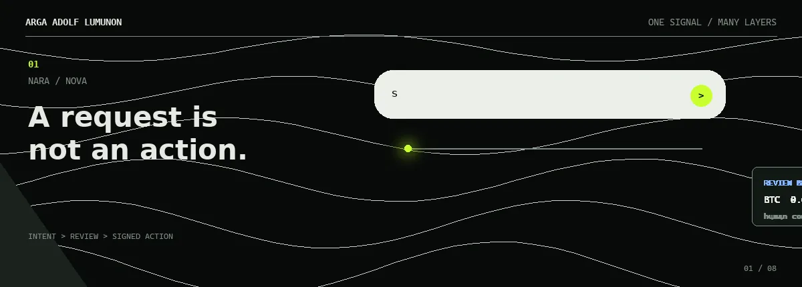

  

  <strong>Software engineer working across systems, models, and constrained platforms.</strong>
   
  I follow a requirement across layers: service topology, model execution, browser evidence,
  product interfaces, or an input driver. The stack follows the constraint.

## Selected systems

- **[Fradium](https://github.com/fradiumofficial/fradium) - WCHL 2025 Fully On-Chain Track
  winner.** On a five-person team, I contributed cross-chain transaction-risk analysis,
  Rust/ONNX/Wasm inference, stable model persistence, ICPSwap integration, wallet features, and
  Paylink. The project also placed first in the qualification and Indonesia rounds and second in Asia.
- **Marketizen - backend and deployment owner.** I built a Go marketplace as a modular monolith
  with PostgreSQL, RabbitMQ, Redis, PgBouncer, Traefik, and Docker Swarm. A 1,000-virtual-user
  plateau completed 20,320 requests with all 40,640 semantic checks passing at 328.57 ms p95 latency.
- **[Nara Wallet](https://github.com/gaskeunbang/nara) - NextGen Agents Hackathon winner.** I
  contributed multi-exchange market-data acquisition, deterministic feature scaling, and
  LightGBM-to-ONNX execution-cost inference for a Wasm-compatible conversational wallet.
- **[SpecHeal](https://github.com/antech2-async/SpecHeal) - Refactory Hackathon 2026 second
  place.** On a two-person team, I built evidence-gated Playwright recovery with DOM and screenshot
  capture, structured AI evaluation, browser rerun proof, patch previews, and audit trails.
- **[Nabu A1931 Bridge](https://github.com/ArgaAAL/nabu-a1931-bridge) - shipped compatibility
  work.** I built native Android multitouch and Windows Precision Touchpad support for an A1931
  Bluetooth keyboard case on Xiaomi Pad 5, with public source, guarded packages, checksums, and
  rollback documentation.
- **[PayGate](https://github.com/wildanniam/paygate-stellar) - funded development.** A paid API
  gateway using Stellar payment rails and Soroban escrow boundaries, accepted for a USD 5,000
  Stellar Community Fund Instaward.

## Technical map

- **Backend and distributed systems:** Go, PostgreSQL, RabbitMQ, Redis, event-driven architecture,
  API gateways, Docker, Kubernetes, and load testing
- **Applied ML systems:** Python, TensorFlow/TFX, PyTorch, ONNX, LightGBM, XGBoost, graph neural
  networks, and constrained inference
- **Constrained platforms:** Rust, WebAssembly, Internet Computer, Stellar/EVM, Android input
  systems, Bluetooth HID, UMDF, and Windows on ARM
- **Product and quality:** TypeScript, React/Next.js, Playwright, CI/CD, human confirmation flows,
  interface prototyping, and reproducible validation

## Current edge

- Private reverse engineering of the Qualcomm camera/CDSP path behind the broken Xiaomi Pad 5
  native Windows on ARM camera stack. This remains an open engineering problem, not a claimed solution.
- Private self-consistency research separating proposal generation from belief accountability through
  compression, provenance, counterfactuals, sandbox tests, and composition. This remains WIP.

Smaller public experiments cover wallet orchestration, execution-cost prediction, Bitcoin and
Ethereum forensics, and recommendation mechanics. Not every repository needs to pretend it is a product.

---

Software Engineering, Telkom University | GPA 3.89/4.00 | thesis completed with grade A 
[LinkedIn](https://www.linkedin.com/in/argaadolflumunon/)

Some projects live in team organizations; every description above is scoped to my contribution.
Earlier work may appear under the <code>gitarRacing</code> identity; <code>ArgaAAL</code> is my current account.

