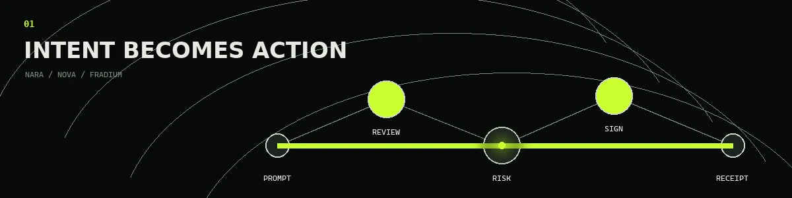
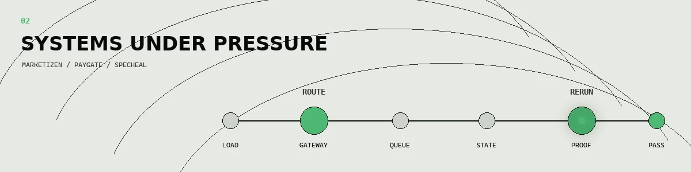
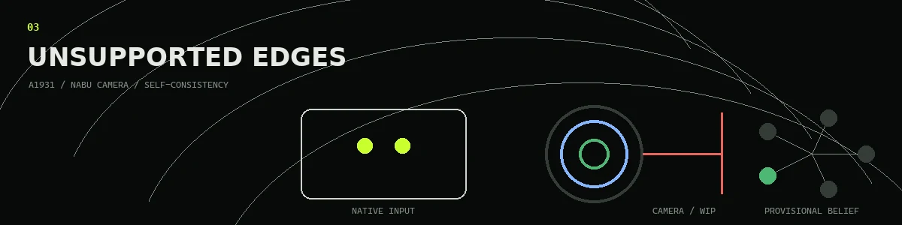

  

  <strong>Software engineer for systems that refuse to stay in one layer.</strong>
   
  I start with the requirement, the failure mode, and the proof that would make the result believable.
  The language, framework, and deployment shape follow from there.
   
  <code>REQUIREMENT &gt; BOUNDARY &gt; DECISION &gt; EVIDENCE</code>

## 01 / Intent becomes action

### [Fradium](https://github.com/fradiumofficial/fradium)

**Transaction intelligence that had to fit inside the transaction flow.** On a five-person team,
I worked across cross-chain risk analysis, Rust/ONNX/Wasm inference, stable model persistence,
ICPSwap integration, wallet features, and Paylink. The model mattered, but so did making its result
legible before a person approved an action.

`TEAM EVIDENCE` WCHL 2025 Fully On-Chain Track winner; first in qualification and Indonesia;
second in Asia.

### [Nara Wallet](https://github.com/gaskeunbang/nara) / Nova Wallet

**Natural language is useful only when execution remains inspectable.** For Nara, I contributed
multi-exchange market data, deterministic feature scaling, and LightGBM-to-ONNX execution-cost
inference for a conversational wallet running within Wasm constraints. Nova explored the adjacent
product problem: turning EVM intent into generative transaction previews with human confirmation
before signing.

`TEAM EVIDENCE` Nara won the NextGen Agents Hackathon. Nova received 1st Notable Mention and
1st place in the Social Media Challenge at SEA Lisk Builders Challenge 3.

<strong>What the interface is protecting</strong>

- Intent can be ambiguous; the transaction preview cannot be.
- Model output is advisory until deterministic checks and user confirmation agree.
- Risk belongs near the decision, not buried in a separate dashboard.
- These are team projects; the descriptions above are intentionally scoped to my contribution.

## 02 / Systems under pressure

### Marketizen

**A marketplace backend built around load, ownership, and failure boundaries.** I implemented the
backend and deployment as a Go modular monolith using PostgreSQL, RabbitMQ, Redis, PgBouncer,
Traefik, and Docker Swarm. The architecture stayed extractable without paying the operational cost
of premature microservices.

`LOAD EVIDENCE` A 1,000-virtual-user plateau completed 20,320 requests and all 40,640 semantic
checks at 328.57 ms p95 latency.

### [PayGate](https://github.com/wildanniam/paygate-stellar)

**A paid API gateway where payment is part of request authorization.** The current testnet path
combines a paid proxy, Stellar payment rails, and Soroban escrow boundaries instead of treating
settlement as a disconnected billing screen.

`FUNDING EVIDENCE` Accepted for a USD 5,000 Stellar Community Fund Instaward.

### [SpecHeal](https://github.com/antech2-async/SpecHeal)

**UI test recovery that refuses a convenient false green.** A failed selector first becomes DOM and
screenshot evidence; an AI patch candidate is then browser-validated, rerun, and recorded before it
can be treated as recovery.

`TEAM EVIDENCE` Second place at Refactory Hackathon 2026.

<strong>Why these systems share a chapter</strong>

They solve different product problems, but the engineering question is the same: where should
pressure be absorbed? Marketizen makes load explicit, PayGate makes authorization and settlement
explicit, and SpecHeal makes proof explicit. Hiding those boundaries would make each interface
simpler and each system less trustworthy.

## 03 / Unsupported edges

### [Nabu A1931 Bridge](https://github.com/ArgaAAL/nabu-a1931-bridge) / Nabu Camera

**One finished bridge and one open hardware problem.** The public A1931 bridge turns a Bluetooth
keyboard case into native multitouch on Xiaomi Pad 5 across Android and Windows on ARM. It ships
with guarded packages, checksums, compatibility boundaries, and rollback documentation.

The separate camera investigation is private and still in progress. It maps the Qualcomm camera and
CDSP path behind the broken native Windows on ARM camera stack. A green frame is a symptom, not a
solution, so this remains labelled WIP.

### Self-consistency research

**A private, unfinished inquiry into how beliefs earn persistence.** The working architecture keeps
proposal generation separate from belief accountability: compression, provenance, counterfactuals,
sandbox tests, and composition determine whether a hypothesis survives provisionally. It is neither
a finished AGI claim nor a symbolic-AI toy dressed up as one.

<strong>Public-safe boundary</strong>

- **A1931:** complete and public; exact supported hardware and release safeguards are documented.
- **Nabu Camera:** active Windows on ARM reverse engineering; no claim that camera bring-up is solved.
- **Self-consistency:** research architecture and philosophy are still evolving; private code stays private.

## Smaller public probes

Not every repository needs a victory speech. Some are narrow experiments used to answer one
question well:

- **Slippage Prediction Engine:** execution-cost estimation before an on-chain trade.
- **Ethereum and Bitcoin Forensics:** transaction-path and wallet-behavior investigations.
- **Matrix Factorization From Scratch:** recommendation mechanics without hiding behind a library call.
- **Applied ML and automation studies:** smaller public traces from a broader private and team-based body of work.

<strong>Technical map</strong>

- **Backend and distributed systems:** Go, Rust, Python, PostgreSQL, RabbitMQ, Redis, event-driven
  architecture, API gateways, Docker, Kubernetes, and load testing
- **Applied ML systems:** TensorFlow/TFX, PyTorch, ONNX, LightGBM, XGBoost, graph neural networks,
  constrained inference, and evidence-aware automation
- **Constrained platforms:** WebAssembly, Internet Computer, Stellar/EVM, Android input systems,
  Windows on ARM, Bluetooth HID, and UMDF
- **Product and quality:** TypeScript, React/Next.js, Playwright, CI/CD, human-in-the-loop flows,
  interface prototyping, and reproducible validation

---

Software Engineering, Telkom University | GPA 3.89/4.00 | thesis completed with grade A 
[LinkedIn](https://www.linkedin.com/in/argaadolflumunon/)

Several projects live in team organizations; every description above is scoped to my contribution.
Earlier work may appear under the <code>gitarRacing</code> identity; <code>ArgaAAL</code> is my current account.

