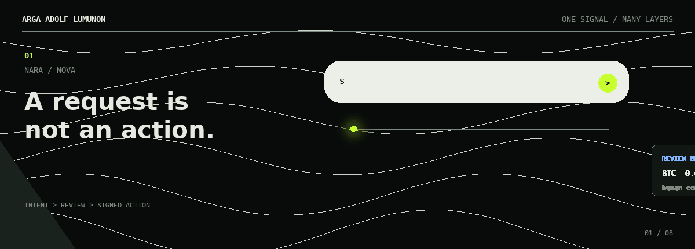
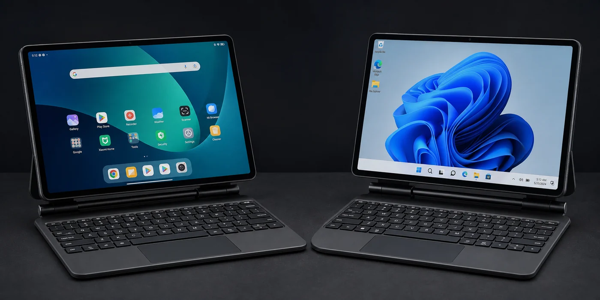

  

  <strong>Some problems stay politely inside one layer. The interesting ones usually do not.</strong>
   
  I build software where the requirement crosses boundaries: service topology, model execution,
  browser evidence, product interfaces, and unsupported hardware.
   
  The stack is a decision, not an identity.

## Systems that had to work

### [Fradium](https://github.com/fradiumofficial/fradium)

**Forensic transaction intelligence under on-chain constraints.** On a five-person team, I
worked across the AI and product boundary: cross-chain risk analysis, Rust/ONNX/Wasm inference,
stable model persistence, ICPSwap integration, wallet features, and Paylink.

> `CONSTRAINT` Useful risk analysis had to fit a deterministic Wasm runtime and remain legible to
> the person approving the transaction.
>
> `EVIDENCE` WCHL 2025 Fully On-Chain Track winner, first place in the qualification and Indonesia
> rounds, and second place in Asia.

<strong>Open the engineering layer</strong>

- Graph and tabular risk pipelines using GNN and XGBoost approaches
- Rust-side ONNX execution and persistent model state under Internet Computer constraints
- Wallet, swap, and payment-link integration beyond the model itself
- White-box explanations, product flows, testing evidence, and team attribution documented in the repository

 

### [Nabu A1931 Bridge](https://github.com/ArgaAAL/nabu-a1931-bridge)

**One adapted keyboard case. Two native input stacks.** I turned an A1931 Bluetooth keyboard
case into a native multitouch device on Xiaomi Pad 5 across Android and Windows on ARM, instead
of stopping at keyboard compatibility or cursor emulation.

> `ANDROID` BLE HID input is relayed into native multitouch behavior.
>
> `WINDOWS ARM64` A UMDF path exposes Windows Precision Touchpad semantics.
>
> `SHIPPED` Public source, guarded release packages, checksums, exact compatibility boundaries,
> and rollback documentation.

<strong>Why this is more than a device tweak</strong>

The work crosses Bluetooth HID behavior, Android input plumbing, native touch semantics,
Windows UMDF, ARM64 packaging, and failure-safe release design. The repository is intentionally
strict about supported hardware and about what the bridge does not claim to support.

## Elsewhere in the stack

- **[Nara Wallet](https://github.com/gaskeunbang/nara) - NextGen Agents Hackathon winner.**
  Multi-exchange market data, deterministic feature scaling, and LightGBM-to-ONNX execution-cost
  inference for a conversational wallet that runs within Wasm constraints.
- **[SpecHeal](https://github.com/antech2-async/SpecHeal) - Refactory Hackathon 2026 second place.**
  Evidence-gated Playwright recovery: DOM and screenshot capture, structured AI evaluation,
  browser rerun proof, patch previews, and audit trails. No blind self-heal.
- **Marketizen - backend and deployment owner.** A Go marketplace built as a modular monolith with
  PostgreSQL, RabbitMQ, Redis, PgBouncer, Traefik, and Docker Swarm. Its 1,000-virtual-user plateau
  completed 20,320 requests with all 40,640 semantic checks passing at 328.57 ms p95 latency.
- **[PayGate](https://github.com/wildanniam/paygate-stellar) - current.** Stellar-based cross-border
  payment infrastructure accepted for a USD 5,000 Stellar Community Fund Instaward.

## Current edge

The public A1931 bridge is complete. A separate, private Nabu investigation is still in progress:
reverse engineering the Qualcomm camera/CDSP path for the Xiaomi Pad 5 native Windows on ARM port.
The camera stack is an open engineering problem, not a claimed solution.

<strong>Open the technical map</strong>

- **Backend and distributed systems:** Go, PostgreSQL, RabbitMQ, Redis, event-driven architecture,
  API gateways, Docker, and Kubernetes
- **Applied ML systems:** Python, TensorFlow/TFX, PyTorch, ONNX, LightGBM, XGBoost, and graph neural networks
- **Constrained platforms:** Rust, WebAssembly, Internet Computer, Stellar/EVM, Android input systems,
  and Windows on ARM
- **Product and quality:** TypeScript, React/Next.js, Playwright, CI/CD, load testing, and
  evidence-gated automation

---

Software Engineering, Telkom University | GPA 3.89/4.00 | thesis completed with grade A 
[LinkedIn](https://www.linkedin.com/in/argaadolflumunon/)

Some projects live in team organizations; every description above is scoped to my contribution.
Earlier work may appear under the <code>gitarRacing</code> identity; <code>ArgaAAL</code> is my current account.

